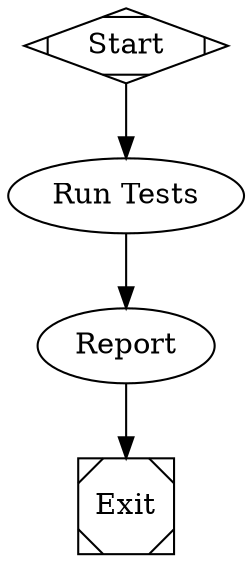

# Attractor

[](https://github.com/anishkny/test/actions/workflows/ci.yml)
[](https://github.com/anishkny/attractor/compare/latest...main)

A DOT-based pipeline runner that uses directed graphs (defined in Graphviz DOT syntax) to orchestrate multi-stage AI workflows.

## Overview

Attractor lets you define multi-stage AI workflows as directed graphs using Graphviz DOT syntax. The graph is the workflow: nodes are tasks, edges are transitions, and attributes configure behavior.

Based on the [Attractor Specification](https://raw.githubusercontent.com/strongdm/attractor/refs/heads/main/attractor-spec.md).

## Features

- **Declarative pipelines** defined in DOT syntax
- **Pluggable handlers** for different node types (LLM calls, conditionals, human gates)
- **Checkpoint and resume** for crash recovery
- **Goal gates** to enforce critical stages
- **Edge-based routing** with conditions and priorities
- **Retry logic** with exponential backoff
- **Comprehensive validation** and linting

## Installation

```bash
pip install -e .
```

## Quick Start

Create a simple pipeline in `example.dot`:



Run the pipeline:

```bash
# Validate the pipeline
python -m attractor.cli example.dot --validate-only

# Execute the pipeline  
python -m attractor.cli example.dot
```

Or use the Python API:

```python
from attractor import parse_dot, run_pipeline

graph = parse_dot("example.dot")
outcome = run_pipeline(graph)
print(f"Pipeline completed with status: {outcome.status.value}")
```

## HTTP Server Mode

Attractor can run as an HTTP service for web-based pipeline management:

```bash
# Install server dependencies
pip install -e ".[server]"

# Start the server
python -m attractor.server
# or use the CLI:
py-attractor-server
```

The server exposes these endpoints:

- `POST /pipelines` - Submit a DOT source and start execution
- `GET /pipelines/{id}` - Get pipeline status and progress
- `GET /pipelines/{id}/events` - Server-Sent Events stream of real-time pipeline events
- `POST /pipelines/{id}/cancel` - Cancel a running pipeline
- `GET /pipelines/{id}/context` - Get current context key-value store
- `GET /health` - Health check

Example usage:

```python
import requests

# Submit a pipeline
response = requests.post('http://localhost:8080/pipelines', json={
    'dot_source': open('example.dot').read()
})
pipeline_id = response.json()['id']

# Get status
status = requests.get(f'http://localhost:8080/pipelines/{pipeline_id}').json()
print(f"Pipeline status: {status['status']}")

# Stream events (requires SSE client)
import sseclient
response = requests.get(
    f'http://localhost:8080/pipelines/{pipeline_id}/events',
    stream=True
)
client = sseclient.SSEClient(response)
for event in client.events():
    print(f"Event: {event.data}")
```

## Documentation

- [Usage Guide](USAGE.md) - Detailed usage and examples
- [Attractor Specification](https://raw.githubusercontent.com/strongdm/attractor/refs/heads/main/attractor-spec.md) - Complete specification

## Testing

```bash
# Run all tests
pytest tests/

# Run with verbose output
pytest tests/ -v
```

Currently **61 tests passing**, including:
- DOT parser tests
- Validation and linting tests  
- Execution engine tests
- Condition evaluation tests
- Handler tests (tool, human-in-the-loop, parallel)
- Event system tests (14 event types)
- Stylesheet parsing and matching tests
- Integration tests matching the spec's smoke test

## Examples

See the `examples/` directory for complete working pipelines:
- `simple.dot` - Basic linear workflow
- `branching.dot` - Conditional branching with goal gates

## Implementation Status

Core features implemented:
- ✅ DOT parser for the supported subset
- ✅ Validation with 7 built-in lint rules
- ✅ Execution engine with retry logic and checkpointing
- ✅ Edge selection with 5-step priority algorithm
- ✅ Condition evaluation (=, !=, && operators)
- ✅ Basic handlers (start, exit, codergen, conditional)
- ✅ Tool handler (parallelogram nodes) - shell command execution
- ✅ Human-in-the-loop handler (hexagon nodes) - interactive gates
- ✅ Parallel execution handler (component nodes) - concurrent branches
- ✅ Fan-in handler (tripleoctagon nodes) - result consolidation
- ✅ Manager loop handler (house nodes) - supervisor pattern for child pipelines
- ✅ Model stylesheet parser - CSS-like LLM configuration
- ✅ CLI interface
- ✅ Variable expansion ($goal)
- ✅ Observability events - typed event system for logging and monitoring
- ✅ HTTP server mode - web API with SSE event streaming

Partially implemented:
- ⏳ Full parallel subgraph execution (current implementation is simplified)

## License

MIT
