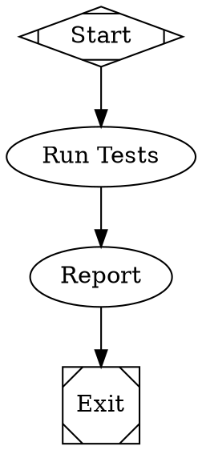

# Attractor

A DOT-based pipeline runner that uses directed graphs (defined in Graphviz DOT syntax) to orchestrate multi-stage AI workflows.

## Overview

Attractor lets you define multi-stage AI workflows as directed graphs using Graphviz DOT syntax. The graph is the workflow: nodes are tasks, edges are transitions, and attributes configure behavior.

## Features

- **Declarative pipelines** defined in DOT syntax
- **Pluggable handlers** for different node types (LLM calls, human gates, conditionals, parallel execution)
- **Checkpoint and resume** for crash recovery
- **Human-in-the-loop** support for approval gates and manual decisions
- **Edge-based routing** with conditions and priorities
- **Model stylesheet** for centralized LLM configuration
- **Comprehensive validation** and linting

## Installation

```bash
pip install -e .
```

## Quick Start

Create a simple pipeline in `example.dot`:



Run the pipeline:

```python
from attractor import parse_dot, run_pipeline

graph = parse_dot("example.dot")
outcome = run_pipeline(graph)
print(f"Pipeline completed with status: {outcome.status}")
```

## Documentation

See the [Attractor Specification](https://raw.githubusercontent.com/strongdm/attractor/refs/heads/main/attractor-spec.md) for complete details.

## License

MIT
