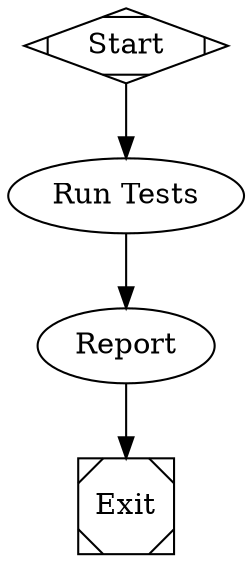

# Attractor

A DOT-based pipeline runner that uses directed graphs (defined in Graphviz DOT syntax) to orchestrate multi-stage AI workflows.

## Overview

Attractor lets you define multi-stage AI workflows as directed graphs using Graphviz DOT syntax. The graph is the workflow: nodes are tasks, edges are transitions, and attributes configure behavior.

Based on the [Attractor Specification](https://raw.githubusercontent.com/strongdm/attractor/refs/heads/main/attractor-spec.md).

## Features

- **Declarative pipelines** defined in DOT syntax
- **Pluggable handlers** for different node types (LLM calls, conditionals, human gates)
- **Checkpoint and resume** for crash recovery
- **Goal gates** to enforce critical stages
- **Edge-based routing** with conditions and priorities
- **Retry logic** with exponential backoff
- **Comprehensive validation** and linting

## Installation

```bash
pip install -e .
```

## Quick Start

Create a simple pipeline in `example.dot`:



Run the pipeline:

```bash
# Validate the pipeline
python -m attractor.cli example.dot --validate-only

# Execute the pipeline  
python -m attractor.cli example.dot
```

Or use the Python API:

```python
from attractor import parse_dot, run_pipeline

graph = parse_dot("example.dot")
outcome = run_pipeline(graph)
print(f"Pipeline completed with status: {outcome.status.value}")
```

## Documentation

- [Usage Guide](USAGE.md) - Detailed usage and examples
- [Attractor Specification](https://raw.githubusercontent.com/strongdm/attractor/refs/heads/main/attractor-spec.md) - Complete specification

## Testing

```bash
# Run all tests
pytest tests/

# Run with verbose output
pytest tests/ -v
```

Currently **27 tests passing**, including:
- DOT parser tests
- Validation and linting tests  
- Execution engine tests
- Condition evaluation tests
- Integration tests matching the spec's smoke test

## Examples

See the `examples/` directory for complete working pipelines:
- `simple.dot` - Basic linear workflow
- `branching.dot` - Conditional branching with goal gates

## Implementation Status

Core features implemented:
- ✅ DOT parser for the supported subset
- ✅ Validation with 7 built-in lint rules
- ✅ Execution engine with retry logic and checkpointing
- ✅ Edge selection with 5-step priority algorithm
- ✅ Condition evaluation (=, !=, && operators)
- ✅ Basic handlers (start, exit, codergen, conditional)
- ✅ CLI interface
- ✅ Variable expansion ($goal)

Not yet implemented:
- ⏳ Human-in-the-loop (hexagon nodes)
- ⏳ Parallel execution (component nodes)
- ⏳ Model stylesheet
- ⏳ HTTP server mode
- ⏳ Observability events

## License

MIT
