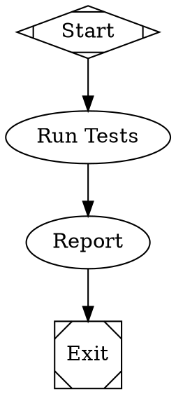
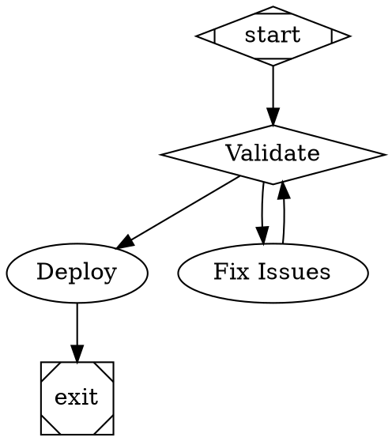
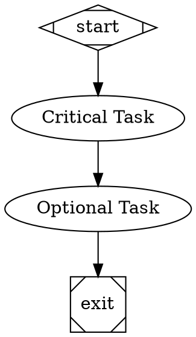
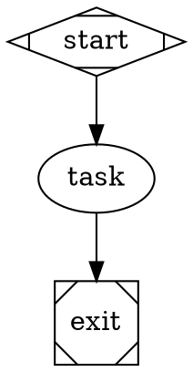
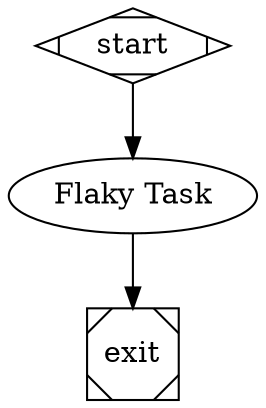

# Attractor Usage Guide

## Installation

```bash
pip install -e .
```

## Basic Usage

### Command Line Interface

Validate a pipeline:
```bash
python -m attractor.cli examples/simple.dot --validate-only
```

Execute a pipeline:
```bash
python -m attractor.cli examples/simple.dot
```

Specify a logs directory:
```bash
python -m attractor.cli examples/simple.dot --logs-root ./my_logs
```

### Python API

```python
from attractor import parse_dot, run_pipeline, Context

# Parse a DOT file
graph = parse_dot("examples/simple.dot")

# Execute the pipeline
context = Context()
outcome = run_pipeline(graph, context=context)

print(f"Status: {outcome.status.value}")
print(f"Notes: {outcome.notes}")
```

## Creating Pipelines

### Basic Linear Pipeline



Key elements:
- `digraph Name { ... }` - Define a directed graph
- `graph [goal="..."]` - Set pipeline-level attributes
- `start [shape=Mdiamond]` - Entry point (required)
- `exit [shape=Msquare]` - Exit point (required)
- `prompt="..."` - Instructions for LLM tasks
- `->` - Connect nodes with edges

### Conditional Branching



Conditional routing:
- `shape=diamond` - Conditional routing node
- `condition="outcome=success"` - Route based on outcome
- `condition="outcome!=success"` - Negation
- Use `&&` for AND: `condition="outcome=success && tests_passed=true"`

### Goal Gates



Goal gates:
- `goal_gate=true` - Must succeed before pipeline can exit
- `retry_target="node_id"` - Where to jump if gate fails
- Enforced at exit nodes

### Variable Expansion



Variables:
- `$goal` - Expands to the graph-level goal attribute
- Used in prompt templates

### Retry Logic



Retry configuration:
- `max_retries=N` - Number of additional attempts (0-50)
- `timeout="900s"` - Maximum execution time
- Backoff delay between retries

### Node Shapes and Handlers

| Shape           | Handler Type | Description |
|-----------------|--------------|-------------|
| `Mdiamond`      | start        | Pipeline entry point |
| `Msquare`       | exit         | Pipeline exit point |
| `box` (default) | codergen     | LLM task |
| `diamond`       | conditional  | Conditional routing |
| `hexagon`       | wait.human   | Human interaction (not yet implemented) |

## Custom Backend Integration

To integrate with your own LLM backend:

```python
from attractor import parse_dot, run_pipeline
from attractor.handlers import CodergenBackend, HandlerRegistry, CodergenHandler
from attractor.models import Node, Context, Outcome, StageStatus

class MyLLMBackend(CodergenBackend):
    def run(self, node: Node, prompt: str, context: Context):
        # Your LLM integration here
        response = my_llm_api.complete(prompt)
        return response

# Create registry with custom backend
registry = HandlerRegistry()
registry.set_default(CodergenHandler(backend=MyLLMBackend()))

# Run pipeline
graph = parse_dot("my_pipeline.dot")
outcome = run_pipeline(graph, handler_registry=registry)
```

## Directory Structure

When a pipeline executes, it creates this structure:

```
logs/run_YYYYMMDD_HHMMSS/
├── manifest.json           # Pipeline metadata
├── checkpoint.json         # Execution state
├── node1/
│   ├── prompt.md          # Input prompt
│   ├── response.md        # LLM response
│   └── status.json        # Execution outcome
└── node2/
    ├── prompt.md
    ├── response.md
    └── status.json
```

## Validation

Attractor includes built-in validation rules:

```python
from attractor import parse_dot
from attractor.validation import validate, Severity

graph = parse_dot("pipeline.dot")
diagnostics = validate(graph)

for diag in diagnostics:
    print(f"[{diag.severity.value}] {diag.rule}: {diag.message}")
```

Built-in rules:
- `start_node` - Exactly one start node required
- `terminal_node` - At least one exit node required
- `reachability` - All nodes must be reachable from start
- `edge_target_exists` - Edge targets must exist
- `start_no_incoming` - Start node cannot have incoming edges
- `exit_no_outgoing` - Exit node cannot have outgoing edges
- `prompt_on_llm_nodes` - LLM nodes should have prompts

## Testing

Run tests:
```bash
pytest tests/
```

Run with coverage:
```bash
pytest tests/ --cov=attractor --cov-report=html
```

## Examples

See the `examples/` directory for complete working pipelines:
- `simple.dot` - Basic linear workflow
- `branching.dot` - Conditional branching with goal gates
